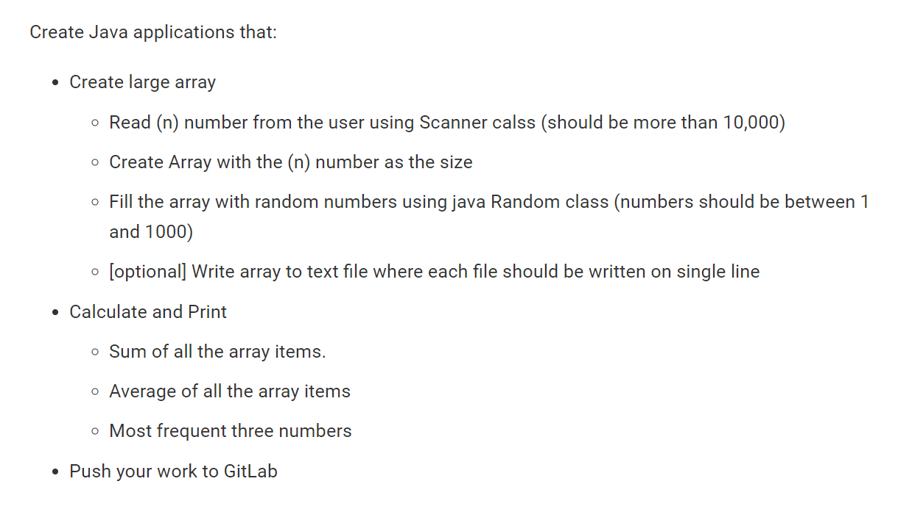
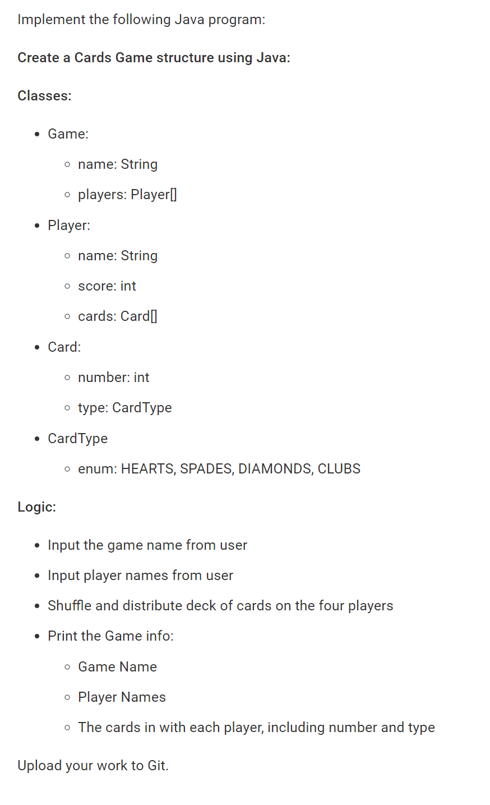
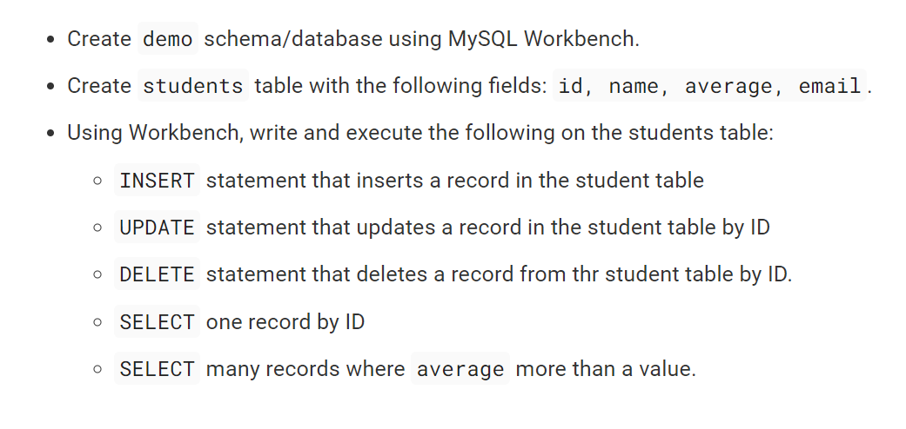
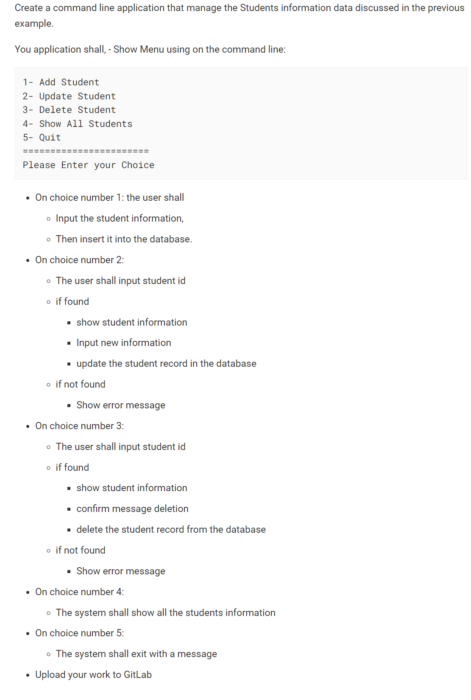

# Java Sde1 Training

These simple codes i wrote based on a 5 days java training  i saw on facebook

## Getting started
Here is the tasks of each day:
 
Day1:
 
 
  
Day2:
 
 
  
Day3:
 

  
Day4:
 
 
  
Day5:
 
 
